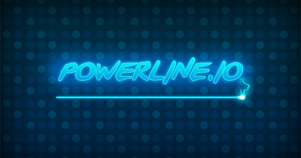
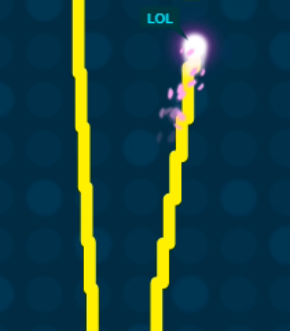
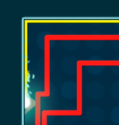

# Super Snake for powerline.io

### Accessibility Features

- <kbd>Ctrl + Arrow</kbd> fixed short distance U-turn

  

- <kbd> Alt + Arrow </kbd> fixed short sideways movement

  

- <kbd>Shift + Arrow</kbd> ultra-short U-turn

  

- <kbd>Ctrl + Shift + Arrow</kbd> automatically turns around intermittently, and the interval is controlled by <kbd>Ctrl+[/]</kbd>

- <kbd>Ctrl + Alt + Arrow</kbd> fixed short sideways movement

  

- When using **Manual Turn** or **Ctrl+Alt+Arrow** to move to the edge of the wall, it will automatically snap to the closest place to the wall

  at this time:

  - Use <kbd>Shift + Arrow</kbd> to still turn around, not Ctrl
  - Press <kbd>Ctrl + Home</kbd> to automatically rotate counterclockwise around the wall
  - When turning close to the corner, it will automatically turn close to the corner

- <kbd>Esc</kbd> Turn on/off auto-send talk

- <kbd>Ctrl + PageUp</kbd> zooms in on the view

- <kbd>Ctrl + PageDown</kbd> Zoom out

### Ornamental features

- <kbd>Ctrl + Letter(A-Z)</kbd> Left in and right out, draw the letter (CapsLock needs to be turned on)

- <kbd>Ctrl + 1</kbd> draws the number 1

- <kbd>Ctrl + ,</kbd> draws a heart shape

  

- <kbd>Ctrl + .</kbd> draws a circle

  

- <kbd>Ctrl + 9</kbd> makes future drawn shapes smaller

- <kbd>Ctrl + 0</kbd> makes future drawn shapes larger

- Optimize unnecessary shake, blur, and shadow, and reduce line width 

**more detail please send email:**  <a href="mailto:faithyxp@foxmail.com">faithyxp@foxmail.com</a>